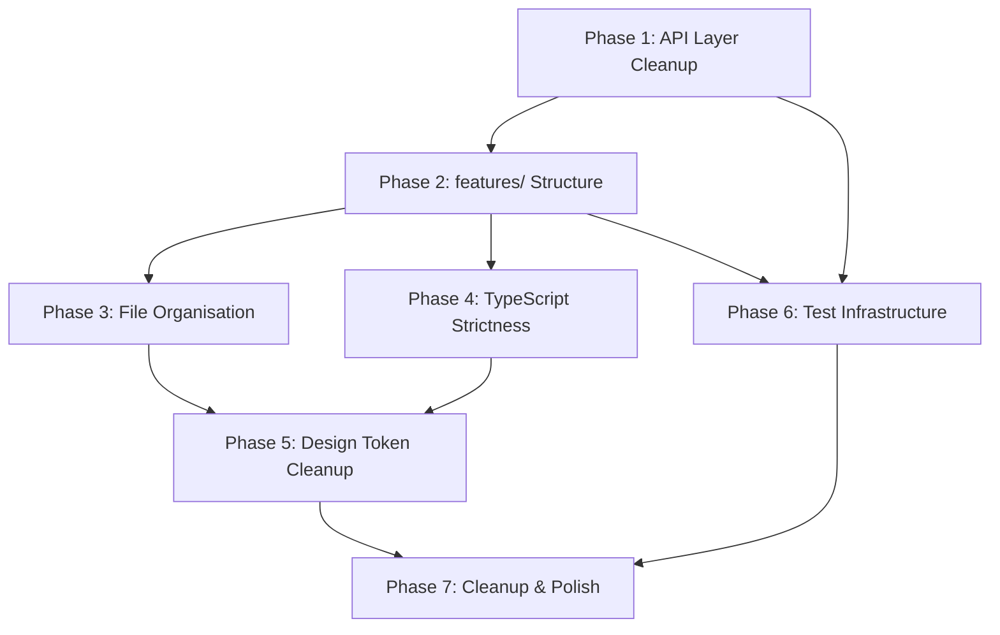

# Luminair UI — Refactoring Plan

A detailed, step-by-step plan to resolve every issue identified in `codebase-analysis.md` and bring the codebase into full conformance with its documented architecture.

> **Scope**: This plan covers structural, code-quality, and testing improvements. It does **not** cover new feature work (authentication, server-side pagination, search/filter) — those belong in a separate roadmap.

---

## Phase 1: API Layer Cleanup

**Goal**: Unify the API layer so all HTTP traffic flows through a single, typed client. Remove production-code test branches.

**Estimated effort**: Small — confined to `src/api/`.

### Step 1.1 — Extend `apiClient` for mutations

**File**: `src/api/client.ts`

Add overloads or a dedicated helper for non-GET requests so that mutations don't need raw `fetch()`:

```ts
export async function apiMutate<TResponse, TBody = unknown>(
  path: string,
  method: 'POST' | 'PUT' | 'DELETE',
  body?: TBody,
): Promise<{ data: TResponse; headers: Headers }> {
  const url = `${BASE_URL}${path}`;
  const response = await fetch(url, {
    method,
    headers: { 'Content-Type': 'application/json' },
    body: body !== undefined ? JSON.stringify(body) : undefined,
  });

  if (!response.ok) {
    // Backend returns RFC 7807 Problem Details on error
    const err: ProblemDetails = await response.json();
    throw err;
  }

  // Some endpoints (201 Created) return empty bodies
  const text = await response.text();
  const data = text ? JSON.parse(text) : undefined;
  return { data: data?.data ?? data, headers: response.headers };
}
```

**Key decisions**:
- Return both `data` and `headers` so `useCreateDocument` can still read the `Location` header.
- Throw `ProblemDetails` directly (instead of the generic `Error` thrown by `apiClient`) for consistent error typing in mutations.

### Step 1.2 — Rewrite mutation hooks to use `apiMutate`

**File**: `src/api/hooks.ts`

Replace the three mutation hooks (`useCreateDocument`, `useUpdateDocument`, `usePublishDocument`) that currently use raw `fetch()`:

- `useCreateDocument`: call `apiMutate<void, CreateDocumentPayload>(path, 'POST', payload)`, then extract the document ID from the returned `headers`.
- `useUpdateDocument`: call `apiMutate<{ data: DocumentRecord }>(path, 'PUT', payload)`.
- `usePublishDocument`: call `apiMutate<{ data: DocumentRecord }>(path, 'POST')`.

Remove the top-level `const BASE_URL = ...` line (L6) — it's now handled inside `apiMutate`.

### Step 1.3 — Remove in-code fallback data for tests

**File**: `src/api/hooks.ts`

Remove all `try/catch` blocks that fall back to `fallbackXxx` data inside `queryFn`. The hooks should simply call `apiClient<T>(path)` without any test-mode branching:

```ts
export const useDocumentTypes = () =>
  useQuery<DocumentResponse[]>({
    queryKey: ['documentTypes'],
    queryFn: () => apiClient<DocumentResponse[]>('/api/meta/documents'),
  });
```

**File**: `src/api/fallbacks.ts`

Move this file to a test utilities directory (e.g., `src/__test_utils__/fixtures.ts` or alongside test files). It will be used by vitest mocks or MSW handlers instead of living inside the production API module.

**File**: `src/api/index.ts`

Remove `export * from './fallbacks'` — test fixtures should not be part of the public API module.

### Step 1.4 — Set up proper test mocking

Create a shared test utility that mocks the `apiClient` module, or install MSW for network-level mocking:

**Option A — vitest module mock** (simpler, recommended for now):

Create `src/__test_utils__/mockApi.ts`:
```ts
import { vi } from 'vitest';
import { fallbackDocumentTypes, fallbackDetailedDocumentTypes, fallbackDocuments } from './fixtures';

export function mockApiClient() {
  vi.mock('@/api/client', () => ({
    apiClient: vi.fn((path: string) => {
      if (path === '/api/meta/documents') return Promise.resolve(fallbackDocumentTypes);
      // ... match other paths
    }),
  }));
}
```

Update existing test files to call `mockApiClient()` in a `beforeEach` block.

### Verification

- [ ] `pnpm build` succeeds — no import errors.
- [ ] `pnpm test` passes — tests still work with the new mock approach.
- [ ] `pnpm lint` clean.
- [ ] Manually confirm dev server can fetch from the backend proxy (no regressions).

---

## Phase 2: Introduce `features/` Directory Structure

**Goal**: Create the documented feature-module boundaries. This is the largest refactor and the highest-impact change.

**Estimated effort**: Medium — mostly file moves and import updates.

### Target Structure

```
src/
├── features/
│   ├── content/
│   │   ├── components/
│   │   │   ├── DocumentForm.tsx          ← extracted from DocumentEditView
│   │   │   ├── DocumentFormField.tsx     ← moved from components/CreateDocumentDrawer/
│   │   │   ├── RelationField.tsx         ← moved from components/CreateDocumentDrawer/
│   │   │   ├── DocumentTable.tsx         ← extracted from DocumentListView
│   │   │   ├── PublishButton.tsx         ← extracted from DocumentListView
│   │   │   └── StatusBadge.tsx           ← extracted (shared status rendering)
│   │   ├── hooks/
│   │   │   └── useDocumentMutations.ts   ← moved from api/hooks.ts (mutations only)
│   │   ├── services/
│   │   │   └── documentApi.ts            ← feature-specific fetchers
│   │   ├── helpers.ts                    ← moved from components/CreateDocumentDrawer/
│   │   ├── helpers.test.ts               ← moved alongside helpers
│   │   ├── types.ts                      ← content-specific types (DocumentRecord, CreateDocumentPayload, etc.)
│   │   └── index.ts                      ← public API barrel
│   │
│   ├── schemas/
│   │   ├── components/
│   │   │   ├── SchemaCard.tsx            ← extracted DetailedSchemaCard
│   │   │   ├── AttributeTypeTag.tsx      ← extracted renderAttributeType
│   │   │   └── ConstraintTags.tsx        ← extracted constraint rendering
│   │   ├── services/
│   │   │   └── schemaApi.ts              ← schema-specific fetchers
│   │   ├── types.ts                      ← schema-specific types (DetailedDocumentResponse, FieldAttribute, etc.)
│   │   └── index.ts
│   │
│   └── settings/
│       ├── components/
│       │   └── SettingsPanel.tsx          ← placeholder for future settings UI
│       └── index.ts
```

### Step 2.1 — Create the `features/content/` module

1. **Create directory**: `src/features/content/components/`, `src/features/content/hooks/`, `src/features/content/services/`.

2. **Move files**:
   - `src/components/CreateDocumentDrawer/DocumentFormField.tsx` → `src/features/content/components/DocumentFormField.tsx`
   - `src/components/CreateDocumentDrawer/RelationField.tsx` → `src/features/content/components/RelationField.tsx`
   - `src/components/CreateDocumentDrawer/helpers.ts` → `src/features/content/helpers.ts`
   - `src/components/CreateDocumentDrawer/helpers.test.ts` → `src/features/content/helpers.test.ts`

3. **Delete** the now-empty `src/components/CreateDocumentDrawer/` directory (including the retired `CreateDocumentDrawer.tsx`).

4. **Extract from `DocumentListView.tsx`**:
   - `PublishButton` component → `src/features/content/components/PublishButton.tsx`
   - `renderLocalizedCell` helper → `src/features/content/helpers.ts` (append)
   - Dynamic column builder logic → `src/features/content/components/DocumentTable.tsx`

5. **Extract from `DocumentEditView.tsx`**:
   - Form rendering + `onFinish` logic → `src/features/content/components/DocumentForm.tsx`
   - The page should only read route params and compose `DocumentForm`.

6. **Create `src/features/content/services/documentApi.ts`**:
   - Move the fetcher functions (just the `apiClient<T>(path)` calls) out of the query hooks.
   - The hooks in `src/features/content/hooks/` will import and wrap them.

7. **Create `src/features/content/index.ts`**:
   ```ts
   // Public API — only export what other modules need
   export { DocumentForm } from './components/DocumentForm';
   export { DocumentTable } from './components/DocumentTable';
   export { PublishButton } from './components/PublishButton';
   ```

### Step 2.2 — Create the `features/schemas/` module

1. **Create directory**: `src/features/schemas/components/`.

2. **Extract from `SchemaInspector.tsx`**:
   - `DetailedSchemaCard` component → `src/features/schemas/components/SchemaCard.tsx`
   - `renderAttributeType` function → `src/features/schemas/components/AttributeTypeTag.tsx`

3. **Create `src/features/schemas/index.ts`**:
   ```ts
   export { SchemaCard } from './components/SchemaCard';
   export { AttributeTypeTag } from './components/AttributeTypeTag';
   ```

### Step 2.3 — Create `features/settings/` (placeholder)

1. Create `src/features/settings/components/SettingsPanel.tsx` — move the Settings page content here.
2. Create `src/features/settings/index.ts`.

### Step 2.4 — Slim down pages

After the extractions, each page should look roughly like:

```tsx
// src/pages/DocumentEditView.tsx
import { FC } from 'react';
import { useParams } from 'react-router-dom';
import { DocumentForm } from '@/features/content';

export const DocumentEditView: FC = () => {
  const { apiId, documentId } = useParams<{ apiId: string; documentId: string }>();
  return <DocumentForm apiId={apiId} documentId={documentId} />;
};
export default DocumentEditView;
```

Target: each page file should be **under 30 lines**.

### Step 2.5 — Split shared API types

Currently `src/api/types.ts` contains types for every domain. Split them:

- `src/features/content/types.ts` — `DocumentRecord`, `CreateDocumentPayload`, `ProblemDetails`, `DocumentResponse`
- `src/features/schemas/types.ts` — `DetailedDocumentResponse`, `FieldAttribute`, `RelationAttribute`, `Attribute`, `FieldConstraint`, `DocumentInfo`, `DocumentOptions`
- `src/api/types.ts` — keep only truly shared types (e.g., `ProblemDetails`, `DocumentResponse`)

Re-export from feature `index.ts` files for external consumption.

### Step 2.6 — Update barrel exports

- Update `src/components/index.ts` — should only export `ErrorBoundary`.
- Remove `src/api/index.ts` wildcard re-exports of moved items.
- Ensure all imports throughout the project use the new paths.

### Verification

- [ ] `pnpm build` succeeds.
- [ ] `pnpm test` passes.
- [ ] `pnpm lint` clean.
- [ ] No circular dependency warnings.
- [ ] Each page file is < 30 lines.
- [ ] `src/components/` contains zero API imports.

---

## Phase 3: File Organisation Alignment

**Goal**: Move files to match the documented directory structure in the README.

**Estimated effort**: Small — file renames only.

### Step 3.1 — Create `src/layout/`

- Move `src/DashboardLayout.tsx` → `src/layout/DashboardLayout.tsx`
- Create `src/layout/index.ts`:
  ```ts
  export { DashboardLayout } from './DashboardLayout';
  ```
- Update import in `src/App.tsx`:
  ```ts
  import { DashboardLayout } from '@/layout';
  ```

### Step 3.2 — Create `src/theme/`

- Move `src/themeConfig.ts` → `src/theme/themeConfig.ts`
- Create `src/theme/index.ts`:
  ```ts
  export { getThemeConfig } from './themeConfig';
  ```
- Update import in `src/App.tsx`:
  ```ts
  import { getThemeConfig } from '@/theme';
  ```

### Step 3.3 — Create `src/hooks/` (empty placeholder)

Create `src/hooks/index.ts` as an empty barrel for future shared hooks:
```ts
// Shared custom hooks
```

### Verification

- [ ] `pnpm build` succeeds.
- [ ] Directory structure matches the README blueprint.

---

## Phase 4: TypeScript Strictness

**Goal**: Eliminate all `any` usage and `@ts-ignore` directives.

**Estimated effort**: Small — localised type fixes.

### Step 4.1 — Fix dynamic columns type in `DocumentTable`

Replace `any[]` with Ant Design's typed columns:

```ts
import type { ColumnsType } from 'antd/es/table';

const dynamicColumns: ColumnsType<DocumentRecord> = [ ... ];
```

### Step 4.2 — Fix relation item types in `helpers.ts`

Define an explicit interface for relation items:

```ts
interface RelationItem {
  documentId?: string;
  [key: string]: unknown;
}
```

Replace `(item: any)` with `(item: RelationItem)` and `(rawVal as any).documentId` with proper type narrowing:

```ts
if (Array.isArray(rawVal)) {
  values[attr.id] = rawVal.map((item: RelationItem) => String(item.documentId ?? item));
} else if (typeof rawVal === 'object' && rawVal !== null && 'documentId' in rawVal) {
  values[attr.id] = String((rawVal as RelationItem).documentId);
}
```

### Step 4.3 — Fix `@ts-ignore` on dayjs import

`dayjs` ships with its own type declarations. Remove the `// @ts-ignore`:

```ts
import dayjs from 'dayjs';
```

If there is a module resolution issue, add `"moduleResolution": "Bundler"` to `tsconfig.app.json` (already present), and ensure `"resolveJsonModule": true` is set (already present). If it still fails, use:

```ts
import dayjs from 'dayjs/esm';
```

Or add `dayjs` to `compilerOptions.types` if needed.

### Verification

- [ ] `pnpm build` succeeds with no type errors.
- [ ] `grep -r "any" src/ --include="*.ts" --include="*.tsx"` returns zero hits (excluding legitimate generic type parameters).
- [ ] `grep -r "@ts-ignore\|@ts-expect-error" src/` returns zero hits.

---

## Phase 5: Design Token & Styling Cleanup

**Goal**: Replace all hardcoded hex colours with Ant Design design tokens and reduce inline style sprawl.

**Estimated effort**: Medium — touches many files but each change is mechanical.

### Step 5.1 — Audit and replace hardcoded colours

Create a mapping of hardcoded values to their design token equivalents:

| Hardcoded Value | Token Replacement | Usage Context |
|---|---|---|
| `#6366f1` | `token.colorPrimary` | Primary accent colour |
| `#10b981` | `token.colorSuccess` | Publish button, success states |
| `#ef4444` | `token.colorError` | Error states |
| `#f59e0b` | `token.colorWarning` | Warning/amber accents |
| `#0f172a` | `token.colorBgLayout` (dark) | Dark backgrounds |
| `#1e293b` | `token.colorBgContainer` (dark) | Dark container backgrounds |
| `#f8fafc` | `token.colorBgLayout` (light) | Light backgrounds |
| `#f1f5f9` | `token.colorBgContainer` (light) | Light container backgrounds |
| `#64748b` | `token.colorTextSecondary` | Secondary text |
| `#94a3b8` | `token.colorTextTertiary` | Tertiary text |
| `#a5b4fc` | `token.colorPrimaryText` | Primary-tinted text |

In each component, use `theme.useToken()`:
```tsx
const { token } = theme.useToken();
// Then use token.colorPrimary instead of '#6366f1'
```

### Step 5.2 — Extract repeated inline styles to CSS modules or classes

Identify the most commonly repeated inline style patterns and extract them to `src/index.css` or component-scoped CSS files:

**Common patterns to extract**:
```css
/* Centered loading spinner container */
.loading-container {
  display: flex;
  justify-content: center;
  align-items: center;
  height: 200px;
}

/* Page header with space-between alignment */
.page-header {
  display: flex;
  justify-content: space-between;
  align-items: center;
  margin-bottom: 24px;
}
```

This is not about moving *all* styles to CSS — inline styles are fine for one-off layout adjustments — but repetitive layout patterns should be extracted.

### Step 5.3 — Review DashboardLayout theme branching

The `DashboardLayout` has multiple ternary expressions for dark/light backgrounds:
```tsx
background: themeMode === 'dark' ? '#1e293b' : '#ffffff'
```

Replace with Ant Design's `token.colorBgContainer` — the `ConfigProvider` already applies the correct algorithm (`darkAlgorithm` or `defaultAlgorithm`), so manual branching is redundant:

```tsx
const { token } = theme.useToken();
// ...
background: token.colorBgContainer
```

### Verification

- [ ] `grep -rn "#[0-9a-fA-F]\{6\}" src/ --include="*.tsx" --include="*.ts"` returns zero hits (excluding `themeConfig.ts` where tokens are defined).
- [ ] Dark mode and light mode both look correct visually.
- [ ] `pnpm build` succeeds.

---

## Phase 6: Test Infrastructure & Coverage

**Goal**: Establish proper test mocking and expand coverage to critical paths.

**Estimated effort**: Medium — new test files.

### Step 6.1 — Create shared test utilities

**File**: `src/__test_utils__/renderWithProviders.tsx`

```tsx
import { FC, PropsWithChildren } from 'react';
import { MemoryRouter } from 'react-router-dom';
import { QueryClient, QueryClientProvider } from '@tanstack/react-query';
import { ConfigProvider } from 'antd';

export const createTestQueryClient = () =>
  new QueryClient({
    defaultOptions: { queries: { retry: false } },
  });

export const TestProviders: FC<PropsWithChildren<{ initialEntries?: string[] }>> = ({
  children,
  initialEntries = ['/'],
}) => {
  const queryClient = createTestQueryClient();
  return (
    <QueryClientProvider client={queryClient}>
      <ConfigProvider>
        <MemoryRouter initialEntries={initialEntries}>
          {children}
        </MemoryRouter>
      </ConfigProvider>
    </QueryClientProvider>
  );
};
```

### Step 6.2 — Add missing test files

Create test files for the following, prioritised by risk:

| Priority | Test File | Covers |
|---|---|---|
| P0 | `src/api/client.test.ts` | `apiClient` success, error parsing, envelope unwrapping |
| P0 | `src/api/hooks.test.ts` | Query hooks return correct data, handle errors |
| P1 | `src/features/content/components/DocumentForm.test.tsx` | Form rendering, submission payload shape |
| P1 | `src/features/content/components/PublishButton.test.tsx` | Publish mutation trigger, loading state |
| P1 | `src/components/ErrorBoundary.test.tsx` | Error catch, recovery actions |
| P2 | `src/store/uiStore.test.ts` | Theme toggle |
| P2 | `src/layout/DashboardLayout.test.tsx` | Sidebar rendering, collapse toggle |
| P2 | `src/features/schemas/components/SchemaCard.test.tsx` | Attribute rendering |

### Step 6.3 — Move test fixtures

Move `src/api/fallbacks.ts` → `src/__test_utils__/fixtures.ts` and update all test imports.

### Verification

- [ ] `pnpm test` passes with expanded coverage.
- [ ] No production code contains test-only branches.
- [ ] Test files follow the `*.test.ts(x)` naming convention.

---

## Phase 7: Cleanup & Polish

**Goal**: Final consistency pass on naming, exports, and documentation.

**Estimated effort**: Small.

### Step 7.1 — Remove retired `CreateDocumentDrawer` remnants

After Phase 2, the `src/components/CreateDocumentDrawer/` directory should be completely empty. Delete it.

### Step 7.2 — Ensure all barrel exports are consistent

Every directory with multiple files should have an `index.ts`:

```
src/api/index.ts          ← export client + shared types only
src/components/index.ts   ← export ErrorBoundary only
src/features/content/index.ts
src/features/schemas/index.ts
src/features/settings/index.ts
src/hooks/index.ts
src/layout/index.ts
src/store/index.ts
src/theme/index.ts
```

### Step 7.3 — Document the dual-export pattern

Add a comment in `AGENTS.md` explaining the named + default export pattern for `lazy()`-loaded pages:

```md
### Export Conventions
* **Named exports** are the default for all modules (per best practices).
* **Page components** additionally use a `default export` because `React.lazy()` requires it.
  Both the named and default export reference the same component declaration.
```

### Step 7.4 — Update the README directory structure

Update the directory tree in `README.md` to reflect the actual structure after all refactoring is complete. Remove the references to `tailwind.config.js` (line 111 of README — Tailwind was excluded from the project).

### Step 7.5 — Run final checks

```bash
pnpm lint
pnpm build
pnpm test
pnpm dlx prettier --check src/
```

### Verification

- [ ] All four commands pass cleanly.
- [ ] README directory tree matches `find src/ -type d | sort`.
- [ ] No dead files or empty directories remain.

---

## Summary — Phase Sequence & Dependencies



| Phase | Description | Effort | Depends On |
|---|---|---|---|
| **1** | API Layer Cleanup | Small | — |
| **2** | `features/` Structure | Medium | Phase 1 |
| **3** | File Organisation | Small | Phase 2 |
| **4** | TypeScript Strictness | Small | Phase 2 |
| **5** | Design Token Cleanup | Medium | Phases 3, 4 |
| **6** | Test Infrastructure | Medium | Phases 1, 2 |
| **7** | Cleanup & Polish | Small | Phases 5, 6 |

**Total estimated effort**: ~3–5 focused working days for an engineer familiar with the codebase.
