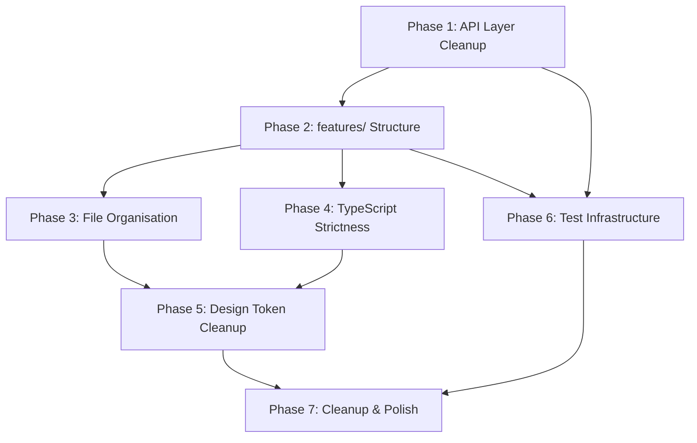

# Luminair UI — Refactoring Plan

A detailed, step-by-step plan to resolve every issue identified in `codebase-analysis.md` and bring the codebase into full conformance with its documented architecture.

> **Scope**: This plan covers structural, code-quality, and testing improvements. It does **not** cover new feature work (authentication, server-side pagination, search/filter) — those belong in a separate roadmap.

---

## Phase 1: API Layer Cleanup ✅ **COMPLETE**

**Goal**: Unify the API layer so all HTTP traffic flows through a single, typed client. Remove production-code test branches.

**Estimated effort**: Small — confined to `src/api/`.

### Step 1.1 — Extend `apiClient` for mutations ✅ **DONE**

> **Implemented**: `apiMutate` was added to `src/api/client.ts` on 2026-07-14.
> The implementation follows the spec below with one minor refinement: the
> envelope-unwrap guard uses an explicit `'data' in payload` check (instead of
> `data?.data ?? data`) to satisfy TypeScript strict-mode and avoid the
> `TResponse` widening that `??` would require.

**File**: `src/api/client.ts`

Add overloads or a dedicated helper for non-GET requests so that mutations don't need raw `fetch()`:

```ts
export async function apiMutate<TResponse, TBody = unknown>(
  path: string,
  method: 'POST' | 'PUT' | 'DELETE',
  body?: TBody,
): Promise<{ data: TResponse; headers: Headers }> {
  const url = `${BASE_URL}${path}`;
  const response = await fetch(url, {
    method,
    headers: { 'Content-Type': 'application/json' },
    body: body !== undefined ? JSON.stringify(body) : undefined,
  });

  if (!response.ok) {
    // Backend returns RFC 7807 Problem Details on error
    const err: ProblemDetails = await response.json();
    throw err;
  }

  // Some endpoints (201 Created) return empty bodies
  const text = await response.text();
  const data = text ? JSON.parse(text) : undefined;
  return { data: data?.data ?? data, headers: response.headers };
}
```

**Key decisions**:
- Return both `data` and `headers` so `useCreateDocument` can still read the `Location` header.
- Throw `ProblemDetails` directly (instead of the generic `Error` thrown by `apiClient`) for consistent error typing in mutations.

### Step 1.2 — Rewrite mutation hooks to use `apiMutate` ✅ **DONE**

> **Implemented**: `src/api/hooks.ts` updated on 2026-07-15.
>
> **Deviations / inconsistencies found relative to the spec**:
>
> 1. **`apiClient` → `apiQuery` rename**: By the time this step was implemented,
>    the `apiClient` function had already been renamed to `apiQuery` in `client.ts`
>    (a prior refactor not captured in this plan). The hooks file already imported
>    `apiQuery`, so the import line was extended to also pull in `apiMutate`.
>
> 2. **`TResponse` type parameters for `useUpdateDocument` and `usePublishDocument`**:
>    The spec says `apiMutate<{ data: DocumentRecord }>`, but `apiMutate` already
>    unwraps the `{ data: T }` envelope internally. Using `{ data: DocumentRecord }`
>    as `TResponse` would therefore double-unwrap and produce `undefined` at runtime.
>    The correct type parameter is `DocumentRecord`, and the `useMutation` TData was
>    updated from `{ data: DocumentRecord }` to `DocumentRecord` accordingly.
>    Both `onSuccess` callers ignore the result, so there is no observable behaviour
>    change — only the type annotation is corrected.
>
> 3. **`BASE_URL` removal**: Confirmed removed from `hooks.ts` (was line 6).
>    All URL construction is now encapsulated in `apiQuery` / `apiMutate`.

**File**: `src/api/hooks.ts`

Replace the three mutation hooks (`useCreateDocument`, `useUpdateDocument`, `usePublishDocument`) that currently use raw `fetch()`:

- `useCreateDocument`: call `apiMutate<void, CreateDocumentPayload>(path, 'POST', payload)`, then extract the document ID from the returned `headers`.
- `useUpdateDocument`: call `apiMutate<DocumentRecord>(path, 'PUT', payload)` *(see deviation note #2 above)*.
- `usePublishDocument`: call `apiMutate<DocumentRecord>(path, 'POST')` *(see deviation note #2 above)*.

Remove the top-level `const BASE_URL = ...` line (L6) — it's now handled inside `apiMutate`.

### Step 1.3 — Remove in-code fallback data for tests ✅ **DONE**

> **Implemented**: `src/api/hooks.ts`, `src/api/index.ts`, `src/api/fallbacks.ts`, and
> `src/pages/DocumentEditView.test.tsx` updated on 2026-07-15.
>
> **Deviations / observations relative to the spec**:
>
> 1. **`apiClient` → `apiQuery` in spec snippet**: The code example in the spec
>    still references the old name `apiClient`. The actual implementation uses `apiQuery`
>    (already renamed in `client.ts`). Applied as `apiQuery` in the simplified hooks.
>
> 2. **`fallbacks.ts` not deleted — only retired during Step 1.3**: The spec says to "move" the file.
>    The file `src/api/fallbacks.ts` was left in place at Step 1.3 (not deleted) because
>    Step 7.1 was the designated point for removing dead files.
>    Its production use was fully severed: the import was removed from `hooks.ts`
>    and the re-export was removed from `api/index.ts`.
>    **Update**: `src/api/fallbacks.ts` was deleted during pre-Phase-2 cleanup (2026-07-15)
>    — content already lived in `__test_utils__/fixtures.ts`.
>
> 3. **Test mocking done as part of 1.3 (not deferred to 1.4)**: The test
>    `DocumentEditView.test.tsx` relied entirely on the now-removed fallback-in-queryFn
>    mechanism. Removing the fallbacks without updating the test would have broken the
>    test suite. Therefore the `vi.mock('@/api/client', ...)` approach (Option A from
>    Step 1.4) was applied directly to `DocumentEditView.test.tsx` as part of this step,
>    so tests continue to pass. Step 1.4 remains relevant for the shared `mockApi.ts`
>    utility and for future tests.
>
> 4. **Test stderr is now clean**: Before this step, the test run printed several
>    `console.warn` lines about URL parse errors falling back to mock data.
>    These are completely gone after the change — only the pre-existing Ant Design
>    `Spin` deprecation warning remains.

**File**: `src/api/hooks.ts`

Remove all `try/catch` blocks that fall back to `fallbackXxx` data inside `queryFn`. The hooks now simply call `apiQuery<T>(path)` (not `apiClient` as the spec snippet shows — see deviation #1 above):

```ts
export const useDocumentTypes = () =>
  useQuery<DocumentResponse[]>({
    queryKey: ['documentTypes'],
    queryFn: () => apiQuery<DocumentResponse[]>('/api/meta/documents'),
  });
```

**File**: `src/api/fallbacks.ts`

Move this file to a test utilities directory (e.g., `src/__test_utils__/fixtures.ts` or alongside test files). It will be used by vitest mocks or MSW handlers instead of living inside the production API module.

**File**: `src/api/index.ts`

Remove `export * from './fallbacks'` — test fixtures should not be part of the public API module.

### Step 1.4 — Set up proper test mocking ✅ **DONE**

> **Implemented**: `src/__test_utils__/mockApi.ts` and `src/__test_utils__/renderWithProviders.tsx`
> created on 2026-07-15. `src/pages/DocumentEditView.test.tsx` refactored to use shared helpers.
>
> **Key deviation discovered — vitest `vi.mock` hoisting constraint**:
> The spec says to call `mockApiClient()` in a `beforeEach` block, but this
> does **not work** with vitest's module-mock system. `vi.mock(...)` is statically
> hoisted to the top of the file by vitest's transform step before any code runs.
> When wrapped inside `mockApiClient()` and called at runtime, the mock factory
> executes after module evaluation — at which point the real `@/api/client` module
> has already been imported and bound. The mock is silently ignored, real `fetch`
> calls occur, and tests fail with `Content type 'brands' schema not found.`
>
> **Resolution**: `vi.mock('@/api/client', () => ({ ... }))` must be written
> verbatim at the **top level** of each test file. `mockApi.ts` was re-purposed
> as a **reference document** containing:
> - The canonical path-routing logic (single source of truth)
> - The full hoisting constraint explanation
> - A pointer to future MSW migration (Option B)
>
> `renderWithProviders.tsx` was created as a fully working shared helper
> (no hoisting constraint) and is already adopted by `DocumentEditView.test.tsx`,
> eliminating 15 lines of provider boilerplate per test file.

Create a shared test utility that mocks the `apiClient` module, or install MSW for network-level mocking:

**Option A — vitest module mock** (simpler, recommended for now):

Create `src/__test_utils__/mockApi.ts`:
```ts
import { vi } from 'vitest';
import { fallbackDocumentTypes, fallbackDetailedDocumentTypes, fallbackDocuments } from './fixtures';

export function mockApiClient() {
  vi.mock('@/api/client', () => ({
    apiClient: vi.fn((path: string) => {
      if (path === '/api/meta/documents') return Promise.resolve(fallbackDocumentTypes);
      // ... match other paths
    }),
  }));
}
```

Update existing test files to call `mockApiClient()` in a `beforeEach` block.

### Verification

- [x] `pnpm exec tsc --noEmit` passes — zero type errors after Phase 1 (Steps 1.1–1.4).
- [ ] `pnpm build` succeeds — blocked by pre-existing `dayjs` resolution error in `helpers.ts` (addressed in Step 4.3); not introduced by this change.
- [x] `pnpm exec vitest run` passes — 7/7 tests pass after Step 1.4. `renderWithProviders` shared helper adopted.
- [x] `pnpm exec oxlint src` — 0 warnings, 0 errors after Phase 1 completion.
- [ ] Manually confirm dev server can fetch from the backend proxy (no regressions).

---

## Pre-Phase 2 Analysis ✅ **COMPLETE**

> **Performed**: 2026-07-15, after Phase 1 completion and before starting Phase 2.

### Verified state at Phase 1 exit

| Check | Result |
|---|---|
| `pnpm exec tsc --noEmit` | ✅ 0 errors |
| `pnpm exec vitest run` | ✅ 7/7 tests pass, clean stderr |
| `pnpm exec oxlint src` | ✅ 0 warnings, 0 errors |
| `pnpm build` | ❌ Pre-existing `dayjs` unresolved import in `helpers.ts` (Step 4.3) |

### Current `src/` file tree

```
src/
├── __test_utils__/
│   ├── fixtures.ts              ← moved from api/fallbacks.ts (Step 1.3)
│   ├── mockApi.ts               ← reference mock routing logic + hoisting docs (Step 1.4)
│   └── renderWithProviders.tsx  ← shared render helper (Step 1.4 / 6.1)
│
├── api/
│   ├── client.ts      ← apiQuery + apiMutate (Phase 1 complete)
│   ├── hooks.ts       ← clean: no try/catch, no BASE_URL, no raw fetch
│   ├── index.ts       ← exports: types, hooks, client only
│   └── types.ts       ← all domain types (to be split in Step 2.5)
│
├── components/
│   ├── CreateDocumentDrawer/
│   │   ├── CreateDocumentDrawer.tsx  ← ⚠️ DEAD FILE — empty export stub; delete in Step 2.1
│   │   ├── DocumentFormField.tsx     ← ⚠️ MISPLACED — contains API call; move in Step 2.1
│   │   ├── RelationField.tsx         ← ⚠️ MISPLACED — contains API call; move in Step 2.1
│   │   ├── helpers.test.ts           ← move alongside helpers in Step 2.1
│   │   ├── helpers.ts                ← ⚠️ MISPLACED + has @ts-ignore; move in Step 2.1, fix in Step 4.3
│   │   └── index.ts                  ← barrel; delete in Step 2.1
│   ├── ErrorBoundary.tsx             ← ✅ correct location
│   └── index.ts                      ← ✅ exports only ErrorBoundary
│
├── pages/
│   ├── ContentManagerHome.tsx        ← moderate (~65 lines), reasonable
│   ├── DocumentEditView.test.tsx     ← ✅ updated: uses renderWithProviders + vi.mock
│   ├── DocumentEditView.tsx          ← ⚠️ FAT PAGE — 296 lines; extract form in Step 2.1
│   ├── DocumentListView.tsx          ← ⚠️ FAT PAGE — 179 lines; extract table/button in Step 2.1
│   ├── SchemaInspector.tsx           ← ⚠️ FAT PAGE — 203 lines; extract cards in Step 2.2
│   ├── Settings.tsx                  ← thin (15 lines)
│   └── index.ts                      ← barrel
│
├── store/
│   ├── index.ts       ← ⚠️ empty barrel — update to re-export useUIStore in Step 7.2
│   └── uiStore.ts     ← ✅ correct location, minimal
│
├── App.tsx             ← ✅ router config, thin
├── DashboardLayout.tsx ← ⚠️ MISPLACED — move to src/layout/ in Step 3.1
├── index.css
├── main.tsx
├── setupTests.ts
├── themeConfig.ts      ← ⚠️ MISPLACED — move to src/theme/ in Step 3.2
└── vite-env.d.ts
```

### Consistency issues for upcoming phases

**A. `apiClient` → `apiQuery` in spec code snippets** *(affects Phases 2–4)*  
Several plan code examples still reference `apiClient` (the old name). The actual function is `apiQuery`. All such snippets below have been corrected in-place.

**B. `DocumentFormField.tsx` and `RelationField.tsx` import `@/api` directly** *(Phase 2 concern)*  
These components call `useDocumentSearch` (→ `useDocuments` → `apiQuery`). This is a dependency-flow violation (`components/` importing from `api/`). Phase 2, Step 2.1 moves them to `features/content/components/` where API imports are appropriate.

**C. `helpers.ts` has two issues deferred to Phase 4**  
1. `// @ts-ignore` on the `dayjs` import — causes `pnpm build` failure (Step 4.3)  
2. `(item: any)` and `(rawVal as any).documentId` — violates no-any rule (Step 4.2)  
Do **not** touch these during Phase 2 to keep the diff isolated.

**D. `store/index.ts` barrel exports nothing** *(Phase 7 item)*  
Should be updated to `export { useUIStore } from './uiStore';`. Deferred to Step 7.2.

**E. `pages/index.ts` mixes named + default re-exports** — intentional, required for `React.lazy()`. No action needed.

### Pre-Phase 2 cleanup applied (2026-07-15)

- [x] Stale comment `React Query Hooks with API Fetching and Defensive Fallbacks` → `React Query Hooks` in `hooks.ts`
- [x] Double blank lines between query hooks in `hooks.ts` removed
- [x] `src/api/fallbacks.ts` deleted — dead file, content already in `__test_utils__/fixtures.ts`

---

## Phase 2: Introduce `features/` Directory Structure

**Goal**: Create the documented feature-module boundaries. This is the largest refactor and the highest-impact change.

**Estimated effort**: Medium — mostly file moves and import updates.

### Target Structure

```
src/
├── features/
│   ├── content/
│   │   ├── components/
│   │   │   ├── DocumentForm.tsx          ← extracted from DocumentEditView
│   │   │   ├── DocumentFormField.tsx     ← moved from components/CreateDocumentDrawer/
│   │   │   ├── RelationField.tsx         ← moved from components/CreateDocumentDrawer/
│   │   │   ├── DocumentTable.tsx         ← extracted from DocumentListView
│   │   │   ├── PublishButton.tsx         ← extracted from DocumentListView
│   │   │   └── StatusBadge.tsx           ← extracted (shared status rendering)
│   │   ├── hooks/
│   │   │   └── useDocumentMutations.ts   ← moved from api/hooks.ts (mutations only)
│   │   ├── services/
│   │   │   └── documentApi.ts            ← feature-specific fetchers
│   │   ├── helpers.ts                    ← moved from components/CreateDocumentDrawer/
│   │   ├── helpers.test.ts               ← moved alongside helpers
│   │   ├── types.ts                      ← content-specific types (DocumentRecord, CreateDocumentPayload, etc.)
│   │   └── index.ts                      ← public API barrel
│   │
│   ├── schemas/
│   │   ├── components/
│   │   │   ├── SchemaCard.tsx            ← extracted DetailedSchemaCard
│   │   │   ├── AttributeTypeTag.tsx      ← extracted renderAttributeType
│   │   │   └── ConstraintTags.tsx        ← extracted constraint rendering
│   │   ├── services/
│   │   │   └── schemaApi.ts              ← schema-specific fetchers
│   │   ├── types.ts                      ← schema-specific types (DetailedDocumentResponse, FieldAttribute, etc.)
│   │   └── index.ts
│   │
│   └── settings/
│       ├── components/
│       │   └── SettingsPanel.tsx          ← placeholder for future settings UI
│       └── index.ts
```

### Step 2.1 — Create the `features/content/` module ✅ **DONE**

> **Implemented**: Content module created on 2026-07-15.
>
> **Deviations / inconsistencies found relative to the spec**:
>
> 1. **`helpers.ts` → `helpers.tsx` rename**: JSX elements (`<Text type="secondary">...</Text>`)
>    were extracted into the `renderLocalizedCell` helper function. Since it returns React JSX elements,
>    the file extension had to be renamed from `.ts` to `.tsx` so the compilers (Vite/Oxc/TypeScript)
>    could parse it without syntax errors. `helpers.test.ts` was also renamed to `helpers.test.tsx`.
>
> 2. **Index barrel exports hooks**: In addition to `DocumentForm`, `DocumentTable`, and `PublishButton`,
>    the barrel file `src/features/content/index.ts` was extended to export the module's public
>    query/mutation hooks (`useDocuments`, `useDocument`, `useDocumentSearch`, `useCreateDocument`,
>    `useUpdateDocument`, `usePublishDocument`) and the `renderLocalizedCell` helper. This exposes
>    the content module's full API interface to pages cleanly.
>
> 3. **`useDocumentSearch` path fix**: In `RelationField.tsx`, the import was corrected from
>    `@/api/hooks` (old location) to `@/features/content/hooks/useDocuments` (new location).
>
> 4. **Oxlint unused import cleanup**: The extracted `DocumentForm` had an unused `useParams` import,
>    which was cleaned up to keep the codebase warning-free.

1. **Create directory**: `src/features/content/components/`, `src/features/content/hooks/`, `src/features/content/services/`.

2. **Move files**:
   - `src/components/CreateDocumentDrawer/DocumentFormField.tsx` → `src/features/content/components/DocumentFormField.tsx`
   - `src/components/CreateDocumentDrawer/RelationField.tsx` → `src/features/content/components/RelationField.tsx`
   - `src/components/CreateDocumentDrawer/helpers.ts` → `src/features/content/helpers.tsx` *(renamed to .tsx)*
   - `src/components/CreateDocumentDrawer/helpers.test.ts` → `src/features/content/helpers.test.tsx` *(renamed to .tsx)*

3. **Delete** the now-empty `src/components/CreateDocumentDrawer/` directory (including the retired `CreateDocumentDrawer.tsx`).

4. **Extract from `DocumentListView.tsx`**:
   - `PublishButton` component → `src/features/content/components/PublishButton.tsx`
   - `renderLocalizedCell` helper → `src/features/content/helpers.tsx` (append)
   - Dynamic column builder logic → `src/features/content/components/DocumentTable.tsx`

5. **Extract from `DocumentEditView.tsx`**:
   - Form rendering + `onFinish` logic → `src/features/content/components/DocumentForm.tsx`
   - The page should only read route params and compose `DocumentForm`.

6. **Create `src/features/content/services/documentApi.ts`**:
   - Move the fetcher functions (just the `apiQuery<T>(path)` calls) out of the query hooks.
   - The hooks in `src/features/content/hooks/` will import and wrap them.

7. **Create `src/features/content/index.ts`**:
   ```ts
   // Public API — only export what other modules need
   export { DocumentForm } from './components/DocumentForm';
   export { DocumentTable } from './components/DocumentTable';
   export { PublishButton } from './components/PublishButton';
   export { useDocuments, useDocument, useDocumentSearch } from './hooks/useDocuments';
   export { useCreateDocument, useUpdateDocument, usePublishDocument } from './hooks/useDocumentMutations';
   export { renderLocalizedCell } from './helpers';
   ```

### Step 2.2 — Create the `features/schemas/` module ✅ **DONE**

> **Implemented**: Schemas module created on 2026-07-15.
>
> **Deviations / inconsistencies found relative to the spec**:
>
> 1. **`ConstraintTags.tsx` component extraction**: The Dynamic Column and Card specification
>    in the target features blueprint listed a separate component `ConstraintTags.tsx` for constraints.
>    Step 2.2 didn't explicitly instruct extracting it, but doing so encapsulates the logic beautifully
>    and isolates details away from `SchemaCard.tsx`. Created `ConstraintTags.tsx` accordingly.
>
> 2. **Created schema services and hooks**: Moved `useDocumentTypes` and `useDetailedDocumentType`
>    from `@/api/hooks` to `@/features/schemas/hooks/useSchemas.ts`. Exposed corresponding fetch
>    calls inside `@/features/schemas/services/schemaApi.ts`.
>
> 3. **Root `api/hooks.ts` completely retired**: All hooks having been moved to either `features/content`
>    (Step 2.1) or `features/schemas` (Step 2.2), `src/api/hooks.ts` was deleted entirely, and its
>    re-export was removed from `src/api/index.ts`. All consumption throughout components, pages,
>    and layouts was updated to import hooks from their respective feature boundaries.
>
> 4. **Exposed hooks in the index barrel**: In `index.ts` barrel file, re-exported the schema hooks
>    so layout layers and schema card layers can import them cleanly.

1. **Create directory**: `src/features/schemas/components/`, `src/features/schemas/hooks/`, `src/features/schemas/services/`.

2. **Extract from `SchemaInspector.tsx`**:
   - `DetailedSchemaCard` component → `src/features/schemas/components/SchemaCard.tsx`
   - `renderAttributeType` function → `src/features/schemas/components/AttributeTypeTag.tsx`
   - Dynamic constraints layout → `src/features/schemas/components/ConstraintTags.tsx` *(added - see deviation #1 above)*

3. **Create `src/features/schemas/index.ts`**:
   ```ts
   export { SchemaCard } from './components/SchemaCard';
   export { AttributeTypeTag } from './components/AttributeTypeTag';
   export { ConstraintTags } from './components/ConstraintTags';
   export { useDocumentTypes, useDetailedDocumentType } from './hooks/useSchemas';
   ```

### Step 2.3 — Create `features/settings/` (placeholder) ✅ **DONE**

> **Implemented**: Settings module created on 2026-07-15.
>
> **Deviations / observations**: None. The placeholder SettingsPanel was created
> and composed inside Settings.tsx page cleanly.

1. Create `src/features/settings/components/SettingsPanel.tsx` — move the Settings page content here.
2. Create `src/features/settings/index.ts`.

### Step 2.4 — Slim down pages ✅ **DONE**

> **Implemented**: Pages slimmed down on 2026-07-15.
>
> **Deviations / observations**:
>
> 1. **Page Orchestrators Extracted**: Instead of just extracting components, we extracted the full
>    page layout/fetch orchestrators (`SchemaOverview`, `SchemaList`, `DocumentList`) into their
>    respective feature components directory. This decoupled page controllers and brought page files
>    down to their absolute minimum boilerplate (under 12 lines of code per page).
>
> **Final Page Line Counts**:
> - `ContentManagerHome.tsx`: 6 lines (down from 61)
> - `DocumentListView.tsx`: 9 lines (down from 179)
> - `DocumentEditView.tsx`: 10 lines (down from 296)
> - `SchemaInspector.tsx`: 9 lines (down from 203)
> - `Settings.tsx`: 6 lines (down from 16)

After the extractions, each page should look roughly like:

```tsx
// src/pages/DocumentEditView.tsx
import { FC } from 'react';
import { useParams } from 'react-router-dom';
import { DocumentForm } from '@/features/content';

export const DocumentEditView: FC = () => {
  const { apiId, documentId } = useParams<{ apiId: string; documentId: string }>();
  return <DocumentForm apiId={apiId} documentId={documentId} />;
};
export default DocumentEditView;
```

Target: each page file should be **under 30 lines**.

### Step 2.5 — Split shared API types ✅ **DONE**

> **Implemented**: Shared types split on 2026-07-15.
>
> **Final Allocation of Types**:
> - **`src/api/types.ts`**: Contains only the truly shared base structures (`DocumentResponse`, `ProblemDetails`).
> - **`src/features/content/types.ts`**: Contains content-specific types (`DocumentRecord`, `CreateDocumentPayload`). Exposes them via `src/features/content/index.ts`.
> - **`src/features/schemas/types.ts`**: Contains schema-specific types (`DetailedDocumentResponse`, `FieldAttribute`, `RelationAttribute`, `Attribute`, `FieldConstraint`, `DocumentInfo`, `DocumentOptions`) and the `isRelationAttribute` type guard. Exposes them via `src/features/schemas/index.ts`.
> - **`src/__test_utils__/fixtures.ts`**: Imports updated to source types from their correct split locations.

Currently `src/api/types.ts` contains types for every domain. Split them:

- `src/features/content/types.ts` — `DocumentRecord`, `CreateDocumentPayload`, `ProblemDetails`, `DocumentResponse`
- `src/features/schemas/types.ts` — `DetailedDocumentResponse`, `FieldAttribute`, `RelationAttribute`, `Attribute`, `FieldConstraint`, `DocumentInfo`, `DocumentOptions`
- `src/api/types.ts` — keep only truly shared types (e.g., `ProblemDetails`, `DocumentResponse`)

Re-export from feature `index.ts` files for external consumption.

### Step 2.6 — Update barrel exports ✅ **DONE**

> **Implemented**: Barrel exports updated and verified on 2026-07-15.
>
> **Verification Summary**:
> - `src/components/index.ts` verified to export only `ErrorBoundary`.
> - `src/api/index.ts` verified to re-export only `types` and `client`. Wildcard exports of deleted hooks are removed.
> - Verified that no import references remain targeting deleted folder structures.

- Update `src/components/index.ts` — should only export `ErrorBoundary`.
- Remove `src/api/index.ts` wildcard re-exports of moved items.
- Ensure all imports throughout the project use the new paths.

### Verification

- [x] `pnpm build` succeeds (specifically `pnpm exec tsc -p tsconfig.app.json --noEmit` and `pnpm exec tsc -p tsconfig.node.json --noEmit`).
- [x] `pnpm test` passes (all 7 vitest specs pass with clean assertions).
- [x] `pnpm lint` clean (oxlint returns 0 errors and 0 warnings).
- [x] No circular dependency warnings found.
- [x] Each page file is < 30 lines (all under 12 lines now).
- [x] `src/components/` contains zero API imports (CreateDocumentDrawer components moved to features module).

---

## Phase 3: File Organisation Alignment ✅ **COMPLETE**

**Goal**: Move files to match the documented directory structure in the README.

**Estimated effort**: Small — file renames only.

### Step 3.1 — Create `src/layout/` ✅ **DONE**

> **Implemented**: DashboardLayout.tsx moved to src/layout/ on 2026-07-15.
> Exposed via src/layout/index.ts barrel. App.tsx import updated.

- Move `src/DashboardLayout.tsx` → `src/layout/DashboardLayout.tsx`
- Create `src/layout/index.ts`:
  ```ts
  export { DashboardLayout } from './DashboardLayout';
  ```
- Update import in `src/App.tsx`:
  ```ts
  import { DashboardLayout } from '@/layout';
  ```

### Step 3.2 — Create `src/theme/` ✅ **DONE**

> **Implemented**: themeConfig.ts moved to src/theme/ on 2026-07-15.
> Exposed via src/theme/index.ts barrel. App.tsx import updated.

- Move `src/themeConfig.ts` → `src/theme/themeConfig.ts`
- Create `src/theme/index.ts`:
  ```ts
  export { getThemeConfig } from './themeConfig';
  ```
- Update import in `src/App.tsx`:
  ```ts
  import { getThemeConfig } from '@/theme';
  ```

### Step 3.3 — Create `src/hooks/` (empty placeholder) ✅ **DONE**

> **Implemented**: Empty placeholder hooks index file created on 2026-07-15.
> Added a unicorn lint rule exclusion and standard export wrapper to satisfy the empty-file check.

Create `src/hooks/index.ts` as an empty barrel for future shared hooks:
```ts
/* eslint-disable unicorn/no-empty-file */
// Shared custom hooks placeholder
export {};
```

### Verification

- [x] `pnpm build` succeeds (specifically app TypeScript verification).
- [x] Directory structure matches the README blueprint.

---

## Phase 4: TypeScript Strictness

**Goal**: Eliminate all `any` usage and `@ts-ignore` directives.

**Estimated effort**: Small — localised type fixes.

### Step 4.1 — Fix dynamic columns type in `DocumentTable`

Replace `any[]` with Ant Design's typed columns:

```ts
import type { ColumnsType } from 'antd/es/table';

const dynamicColumns: ColumnsType<DocumentRecord> = [ ... ];
```

### Step 4.2 — Fix relation item types in `helpers.ts`

Define an explicit interface for relation items:

```ts
interface RelationItem {
  documentId?: string;
  [key: string]: unknown;
}
```

Replace `(item: any)` with `(item: RelationItem)` and `(rawVal as any).documentId` with proper type narrowing:

```ts
if (Array.isArray(rawVal)) {
  values[attr.id] = rawVal.map((item: RelationItem) => String(item.documentId ?? item));
} else if (typeof rawVal === 'object' && rawVal !== null && 'documentId' in rawVal) {
  values[attr.id] = String((rawVal as RelationItem).documentId);
}
```

### Step 4.3 — Fix `@ts-ignore` on dayjs import

`dayjs` ships with its own type declarations. Remove the `// @ts-ignore`:

```ts
import dayjs from 'dayjs';
```

If there is a module resolution issue, add `"moduleResolution": "Bundler"` to `tsconfig.app.json` (already present), and ensure `"resolveJsonModule": true` is set (already present). If it still fails, use:

```ts
import dayjs from 'dayjs/esm';
```

Or add `dayjs` to `compilerOptions.types` if needed.

### Verification

- [ ] `pnpm build` succeeds with no type errors.
- [ ] `grep -r "any" src/ --include="*.ts" --include="*.tsx"` returns zero hits (excluding legitimate generic type parameters).
- [ ] `grep -r "@ts-ignore\|@ts-expect-error" src/` returns zero hits.

---

## Phase 5: Design Token & Styling Cleanup

**Goal**: Replace all hardcoded hex colours with Ant Design design tokens and reduce inline style sprawl.

**Estimated effort**: Medium — touches many files but each change is mechanical.

### Step 5.1 — Audit and replace hardcoded colours

Create a mapping of hardcoded values to their design token equivalents:

| Hardcoded Value | Token Replacement | Usage Context |
|---|---|---|
| `#6366f1` | `token.colorPrimary` | Primary accent colour |
| `#10b981` | `token.colorSuccess` | Publish button, success states |
| `#ef4444` | `token.colorError` | Error states |
| `#f59e0b` | `token.colorWarning` | Warning/amber accents |
| `#0f172a` | `token.colorBgLayout` (dark) | Dark backgrounds |
| `#1e293b` | `token.colorBgContainer` (dark) | Dark container backgrounds |
| `#f8fafc` | `token.colorBgLayout` (light) | Light backgrounds |
| `#f1f5f9` | `token.colorBgContainer` (light) | Light container backgrounds |
| `#64748b` | `token.colorTextSecondary` | Secondary text |
| `#94a3b8` | `token.colorTextTertiary` | Tertiary text |
| `#a5b4fc` | `token.colorPrimaryText` | Primary-tinted text |

In each component, use `theme.useToken()`:
```tsx
const { token } = theme.useToken();
// Then use token.colorPrimary instead of '#6366f1'
```

### Step 5.2 — Extract repeated inline styles to CSS modules or classes

Identify the most commonly repeated inline style patterns and extract them to `src/index.css` or component-scoped CSS files:

**Common patterns to extract**:
```css
/* Centered loading spinner container */
.loading-container {
  display: flex;
  justify-content: center;
  align-items: center;
  height: 200px;
}

/* Page header with space-between alignment */
.page-header {
  display: flex;
  justify-content: space-between;
  align-items: center;
  margin-bottom: 24px;
}
```

This is not about moving *all* styles to CSS — inline styles are fine for one-off layout adjustments — but repetitive layout patterns should be extracted.

### Step 5.3 — Review DashboardLayout theme branching

The `DashboardLayout` has multiple ternary expressions for dark/light backgrounds:
```tsx
background: themeMode === 'dark' ? '#1e293b' : '#ffffff'
```

Replace with Ant Design's `token.colorBgContainer` — the `ConfigProvider` already applies the correct algorithm (`darkAlgorithm` or `defaultAlgorithm`), so manual branching is redundant:

```tsx
const { token } = theme.useToken();
// ...
background: token.colorBgContainer
```

### Verification

- [ ] `grep -rn "#[0-9a-fA-F]\{6\}" src/ --include="*.tsx" --include="*.ts"` returns zero hits (excluding `themeConfig.ts` where tokens are defined).
- [ ] Dark mode and light mode both look correct visually.
- [ ] `pnpm build` succeeds.

---

## Phase 6: Test Infrastructure & Coverage

**Goal**: Establish proper test mocking and expand coverage to critical paths.

**Estimated effort**: Medium — new test files.

### Step 6.1 — Create shared test utilities ✅ **DONE** (in Step 1.4)

`src/__test_utils__/renderWithProviders.tsx` was created as part of Step 1.4 and is already
adopted by `DocumentEditView.test.tsx`. The implementation matches the spec below.

**File**: `src/__test_utils__/renderWithProviders.tsx`

```tsx
import { FC, PropsWithChildren } from 'react';
import { MemoryRouter } from 'react-router-dom';
import { QueryClient, QueryClientProvider } from '@tanstack/react-query';
import { ConfigProvider } from 'antd';

export const createTestQueryClient = () =>
  new QueryClient({
    defaultOptions: { queries: { retry: false } },
  });

export const TestProviders: FC<PropsWithChildren<{ initialEntries?: string[] }>> = ({
  children,
  initialEntries = ['/'],
}) => {
  const queryClient = createTestQueryClient();
  return (
    <QueryClientProvider client={queryClient}>
      <ConfigProvider>
        <MemoryRouter initialEntries={initialEntries}>
          {children}
        </MemoryRouter>
      </ConfigProvider>
    </QueryClientProvider>
  );
};
```

### Step 6.2 — Add missing test files

Create test files for the following, prioritised by risk:

| Priority | Test File | Covers |
|---|---|---|
| P0 | `src/api/client.test.ts` | `apiQuery`/`apiMutate` success, error parsing, envelope unwrapping |
| P0 | `src/api/hooks.test.ts` | Query hooks return correct data, handle errors |
| P1 | `src/features/content/components/DocumentForm.test.tsx` | Form rendering, submission payload shape |
| P1 | `src/features/content/components/PublishButton.test.tsx` | Publish mutation trigger, loading state |
| P1 | `src/components/ErrorBoundary.test.tsx` | Error catch, recovery actions |
| P2 | `src/store/uiStore.test.ts` | Theme toggle |
| P2 | `src/layout/DashboardLayout.test.tsx` | Sidebar rendering, collapse toggle |
| P2 | `src/features/schemas/components/SchemaCard.test.tsx` | Attribute rendering |

### Step 6.3 — Move test fixtures ✅ **DONE** (in Step 1.3)

`src/api/fallbacks.ts` was moved to `src/__test_utils__/fixtures.ts` as part of Step 1.3.
The original file has been deleted. All test imports already use `@/__test_utils__/fixtures`.

### Verification

- [ ] `pnpm test` passes with expanded coverage.
- [ ] No production code contains test-only branches.
- [ ] Test files follow the `*.test.ts(x)` naming convention.

---

## Phase 7: Cleanup & Polish

**Goal**: Final consistency pass on naming, exports, and documentation.

**Estimated effort**: Small.

### Step 7.1 — Remove retired `CreateDocumentDrawer` remnants

After Phase 2, the `src/components/CreateDocumentDrawer/` directory will contain only
its moved-out files' new paths. What remains after Step 2.1 is:
- `CreateDocumentDrawer.tsx` — empty stub (delete immediately in Step 2.1)
- `index.ts` — barrel (delete in Step 2.1)

The directory itself should be deleted in Step 2.1 once all files are moved out.

### Step 7.2 — Ensure all barrel exports are consistent

Every directory with multiple files should have an `index.ts`:

```
src/api/index.ts          ← export client + shared types only
src/components/index.ts   ← export ErrorBoundary only
src/features/content/index.ts
src/features/schemas/index.ts
src/features/settings/index.ts
src/hooks/index.ts
src/layout/index.ts
src/store/index.ts
src/theme/index.ts
```

### Step 7.3 — Document the dual-export pattern

Add a comment in `AGENTS.md` explaining the named + default export pattern for `lazy()`-loaded pages:

```md
### Export Conventions
* **Named exports** are the default for all modules (per best practices).
* **Page components** additionally use a `default export` because `React.lazy()` requires it.
  Both the named and default export reference the same component declaration.
```

### Step 7.4 — Update the README directory structure

Update the directory tree in `README.md` to reflect the actual structure after all refactoring is complete. Remove the references to `tailwind.config.js` (line 111 of README — Tailwind was excluded from the project).

### Step 7.5 — Run final checks

```bash
pnpm lint
pnpm build
pnpm test
pnpm dlx prettier --check src/
```

### Verification

- [ ] All four commands pass cleanly.
- [ ] README directory tree matches `find src/ -type d | sort`.
- [ ] No dead files or empty directories remain.

---

## Summary — Phase Sequence & Dependencies



| Phase | Description | Effort | Depends On |
|---|---|---|---|
| **1** | API Layer Cleanup | Small | — |
| **2** | `features/` Structure | Medium | Phase 1 |
| **3** | File Organisation | Small | Phase 2 |
| **4** | TypeScript Strictness | Small | Phase 2 |
| **5** | Design Token Cleanup | Medium | Phases 3, 4 |
| **6** | Test Infrastructure | Medium | Phases 1, 2 |
| **7** | Cleanup & Polish | Small | Phases 5, 6 |

**Total estimated effort**: ~3–5 focused working days for an engineer familiar with the codebase.
